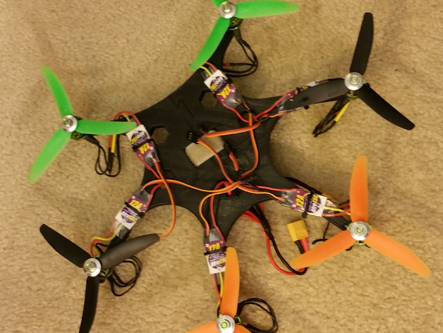

Spider
======
This is a 3D printed Spider hexacopter frame from Thingiverse.
http://www.thingiverse.com/thing:445749

I had to repair the STL files in MeshLab before printing.

Print Settings
--------------
 - PLA
 - 80% infill, rectilinear

Frame Add-ons
-------
I designed zip-tie connected landing gear, and used my Mini MWC box to mount
the FC using zip-ties.

Build
-----
 - Mini MWC flight controller
 - 6x Afro 12 amp ESC
 - 6X Turnigy Multistar 1704 brushless outrunners
 - Turnigy Nano-Tech 1300mAh, 3S lipo
 - Hobbyking 3S battery monitor/alarm
